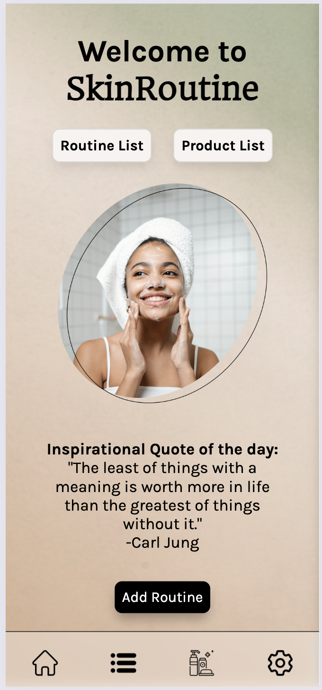

# Skincare Routine Tracker Mobile Site

Welcome to the Skincare Routine Tracker, a mobile site designed to help you improve your skincare habits by providing quick access to your routines and product lists.

## Features

1. **Home Page**
   - Provides quick access to your skincare routines.
   - Offers easy access to your list of skincare products.

2. **Routine Pages**
   - Separate pages for each skincare routine.
   - Includes a checklist for each step in the routine, ensuring you never miss a step.

3. **Products Page**
   - Displays a list of your current skincare products.
   - Allows you to easily update and manage your product list.

## Technologies Used

- MERN
- Public API for Inspirational Quotes ([Inspirational Quotes API](https://github.com/lukePeavey/quotable))

## Wireframe

([Figma Wireframe](https://www.figma.com/file/7yuDyELi5xsIo3sS6rGnbH/SkinRoutine---wireframe?type=design&t=0fjZoryxMWDTLM9n-6))

## The Site

## Scenario

**Goal:** Improve skincare habits
**Want:** Apply the appropriate skincare products for the day
**Need:** Access to the app and the ability to customize routines
**Resolution:** Create and track skincare routines

With the Skincare Routine Tracker, you can easily create and track your skincare routines, helping you achieve your skincare goals.

## User Stories

1. Quotable API for random inspirational quotes
2. Login and Registration using third party authentication

## For Version 2.0
1. Sephora Rapid API to get products by name or barcode
2. Calendar for tracker
3. Animations and micro-interactions